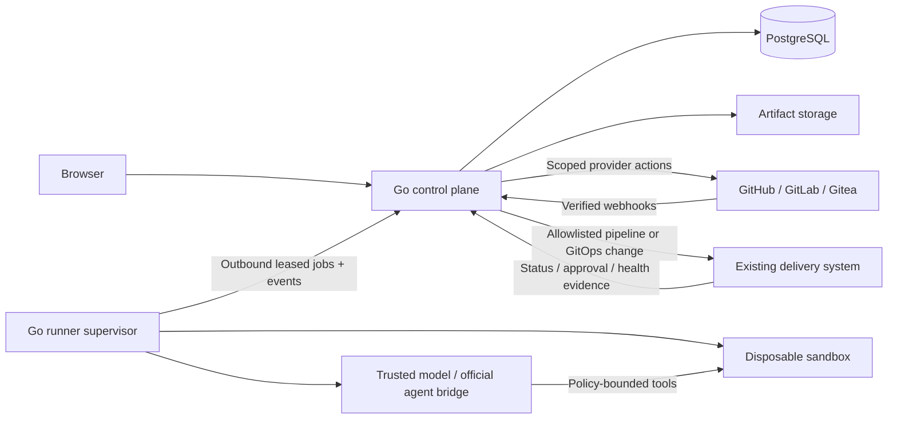

# Architecture

Updated: 2026-09-21. Design targets; not implemented capabilities. T29–T31 planning constraints apply.

## Rebuild and runtime constraints

All components are containerised: Go control plane/GUI, controllers, migrator, runner, approved agent profiles, validation images, docs and local dependencies. Compose clean install must not require host Go/Node/Python or repository-specific `/tmp` paths. Hosted deployment uses versioned GitOps. Chosen sandbox runtime host prerequisites and privilege model must be documented; Docker alone is never tenant isolation. API/task containers receive no Docker socket, and credentials are never baked into images. Official provider authentication and native approvals are required; unsupported or unverified capabilities remain disabled with reason.

## Stack and repository layout

- Go 1.27.x, pin a current security patch at implementation kickoff. Gin for HTTP routing/middleware over `net/http`, context cancellation and `slog`. Gin contexts stay at the transport boundary; domain services use standard Go contexts and typed inputs.
- PostgreSQL 18; `pgx`, `sqlc`, SQL migrations. Integration tests use real PostgreSQL for locking, RLS and recovery semantics.
- React/TypeScript/Vite frontend; TanStack Query for server state and Router for URL-addressable views. Generated TypeScript API types from versioned OpenAPI. Accessible primitives, CSS tokens, lightweight SVG charts.
- OpenTelemetry traces/metrics and structured logs; no source code or prompt bodies in default telemetry.
- Same application source in hosted and self-hosted editions. Backend and runner supervisor are Go; a selected official agent binary is an external executable, not a second application backend.

Planned layout:

```text
cmd/server/                 HTTP API, webhooks, scheduler and controller modes
cmd/runner/                 isolated job supervisor and control-plane client
internal/auth/              sessions, organisation membership and authorisation
internal/store/             SQL, migrations, generated queries and transaction scope
internal/forge/             provider-neutral records and provider implementations
internal/model/             direct inference adapters and capability probes
internal/agent/             tool loop and official agent process bridges
internal/policy/            deterministic evaluator and explanations
internal/maintenance/       findings, recipes, bot coordination and campaigns
internal/workflow/          persisted state machine, leases and reconciliation
internal/deployment/        existing pipeline and GitOps orchestration
internal/artifact/          tenant-scoped artifact access
internal/httpapi/           REST, SSE, webhooks and OpenAPI handlers
api/openapi.yaml            reviewed API contract
web/                       GUI
deploy/compose/             self-hosted application + database + runner
deploy/hosted/              infrastructure examples and GitOps manifests
test/integration/           provider fixtures and real-instance contract suites
test/scenarios/             representative repair and protection corpus
docs/                      specifications and operational documentation
```

## Runtime topology



The control plane never executes repository code. Runners cannot decide to merge or deploy. The model requests bounded tools and produces patches; deterministic server policy authorises each mutation.

### Hosted

- API replicas and controller replicas share PostgreSQL; controller modes can start in one deployment and scale independently without separate services.
- Shared control plane; tenant-bound worker leases. Disposable sandbox per job with fresh filesystem/identity. No repository shares a writable working directory or untrusted build cache with another tenant.
- S3-compatible private artifact storage. Workspaces expire after completion; artifacts are retained by policy.
- Dedicated hosted runner pools may be assigned to an organisation. A customer-owned runner is also supported for private forges/model endpoints and approved official subscription agents.
- Hosted sandbox candidate: gVisor on dedicated worker hosts, or a stronger microVM boundary if required by compatibility/security tests. Ordinary Docker alone is not the hosted cross-tenant boundary.
- Infrastructure rollout is through versioned deployment/GitOps configuration. Operators do not mutate Kubernetes objects outside GitOps.

### Self-hosted

- Docker Compose: server, PostgreSQL, runner supervisor; local volume artifact backend by default, S3-compatible option. Serve the built frontend from Go.
- Single-tenant default does not remove tenant IDs, RLS, RBAC or audit. Same migrations and capabilities as hosted.
- Runner operates on a dedicated host/VM. Mounting a Docker socket into the web server is forbidden. A supervisor's runtime access is confined to its execution host, never mounted into task containers.
- External OIDC supported; first admin bootstrap is single-use, expires, and is disabled after enrolment. Local development auth exists only under an explicit loopback development flag.
- Document backup of database, artifact storage, configuration and encryption key; restoring only the DB does not restore encrypted credentials.

## Tenant and authorisation boundaries

Every tenant-owned row carries `org_id`. Composite foreign keys include `org_id`; indexes and uniqueness constraints are tenant-aware. HTTP handlers never accept an organisation ID as proof of authority.

Each DB request transaction sets tenant context using `SET LOCAL`. Runtime roles are not superusers, table owners or `BYPASSRLS`; use `FORCE ROW LEVEL SECURITY`. Query predicates remain explicitly tenant-scoped. Migration credentials are unavailable to the runtime. System schedulers access only a narrow control queue, then enter a tenant transaction for business data. Do not hand a bypass role to workers.

Audit cross-tenant behaviour for direct IDs, lists, search, SSE replay, downloads, generated URLs, metrics, jobs, connection callbacks and error messages. Cache keys include tenant and permission scope. Object-store prefix separation is not sufficient: the artifact service checks membership and issues short-lived links after authorisation.

Roles:

| Role | Authority |
| --- | --- |
| Owner | Organisation membership, connections, runner enrolment, budgets, policy administration |
| Admin | Repository/team configuration and policies within owner constraints |
| Maintainer | Queue/cancel approved work and manage findings for assigned repositories |
| Reviewer | Inspect evidence and grant application approvals within scope |
| Viewer | Read permitted repository/task state |
| Runner identity | Lease/heartbeat/report its jobs only; no interactive or merge authority |

Application approvals do not replace required forge reviews, environment approvals or separation-of-duties rules. A user without provider authority cannot obtain it through a UI action.

Organisation membership is the outer boundary, not the full permission check. Repository/team scope is enforced for every finding, task, change, artifact, event replay, export and private route. Each child-object lookup resolves its repository scope server-side. RLS protects organisations; application authorisation and scoped query predicates protect teams/repositories within them.

## Durable workflow execution

PostgreSQL `FOR UPDATE SKIP LOCKED` selects eligible jobs within organisation fairness and resource limits. Jobs contain a tenant, stage, idempotency key, lease owner, lease expiry, monotonic fencing token, heartbeat and attempt counter. Renew leases periodically; a lost lease prevents further external mutation.

Persist domain transition and outbox event atomically. Dispatchers perform external calls from the outbox using stable operation IDs and reconciliation. Delivery is at least once; the design does not promise impossible distributed exactly-once delivery.

Runners have no database access. Supervisor enrolment identifies a pool; a separately minted job credential binds allowed operations to server-derived organisation, repository, job, attempt, lease owner, fencing token and expiry. Heartbeats, events, artifact uploads, command results and model requests are rejected for a different or expired binding. Shared supervisors do not receive general tenant-browser credentials.

Reserve budget atomically before dispatch and before each bounded inference allowance. Lock organisation/team/repository/connection budget rows in a consistent order and associate reservations with an idempotent attempt/operation. Settle from reported usage; cancellation releases only provably unused reservations. Unknown late usage remains reserved until reconciliation or a conservative ceiling is charged. Subscription routes also reserve concurrency/time/turn allowances when currency accounting is unavailable.

Before retrying a timed-out publish/merge/deploy call, query the provider for its result. Match PRs by immutable repo IDs and operation marker plus branch/head; match deployments by workflow and recorded correlation ID/SHA. Do not trust a branch name or user-editable PR text alone. Uncertain merge/deployment results enter `reconciling`, not a new invocation.

Per-repository+target-branch write lease prevents conflicting app tasks. External commits/bot refreshes still occur: compare before publication and invalidate verification after any candidate/base mutation. Merge/deploy execution has its own fencing checks and cannot inherit authority from an expired repair lease.

Pause/kill switches exist for organisation, repository, recipe, model connection and runner pool. Check them at dispatch and every mutation boundary. Cancel sends a stop request to the runner; record any already-completed external actions and reconcile them.

## Provider communication

- Forge adapter isolates GitHub REST/GraphQL, GitLab API and Gitea OpenAPI differences. Advertise capabilities and observed server version per connection.
- Verify webhook authentication before enqueueing; deduplicate provider delivery IDs scoped to connection. If no trustworthy delivery ID exists, record a bounded payload digest and reconcile authoritative provider state.
- Resolve tenant using an enrolled connection/installation binding, never an arbitrary tenant value from a webhook body.
- Poll with pagination, conditional requests where available, configurable rate budgets, backoff/jitter and periodic full reconciliation. Webhooks accelerate; polling repairs missed events.
- Auth/revocation or insufficient scope produces an actionable blocked state; do not retry indefinitely or mark data healthy.
- Private self-hosted instances use explicitly enrolled hosts and trust roots via an assigned customer runner or connector route. The outbound runner can broker fixed provider operations; there is no generic arbitrary-URL proxy.
- Block user-controlled redirects/host changes, metadata endpoints and unintended private destinations. Approved private instance/model routes are a per-connection exception, scoped to the runner and tenant; do not globally disable SSRF controls.

## Model and agent execution

Two adapters share run/evidence output, but are separate interfaces:

1. `ModelProvider`: inference via OpenAI, Anthropic, Gemini or self-hosted compatible endpoints. Go owns the constrained tool loop.
2. `AgentExecutor`: launches a supported official coding agent with its documented protocol on a tenant-owned execution identity. Do not convert a subscription token into a generic inference API.

Provider capabilities include tool calling, structured output, streaming, context size, cancellation, image inputs and usage accounting. Probes validate configured endpoints and model IDs; labels such as “OpenAI compatible” do not guarantee every required capability. Unsupported combinations can inspect/summarise but cannot claim autonomous repair certification.

The default selected model is explicit per recipe. Plan/repair/review may choose different profiles; correctness comes from checks and evidence, not a model voting majority. Each run records provider, model ID/version if supplied, profile version, credential reference, execution route and usage source. Official bridges require a pre-execution approval/command-interception capability; an event emitted after a tool ran cannot enforce policy.

Customer credentials are encrypted at rest with envelope keys; hosted uses a KMS-backed wrapping key, self-hosted an operator-provided key. Never return secrets to the GUI. Direct model access goes through a scoped broker where supported; the repository process receives no long-lived provider key. Official-agent credentials reside in a separate user-owned runner identity and never in the repository filesystem. The bridge must prove repository commands cannot read that auth material; disable the route if that cannot be achieved.

The model broker authenticates only the trusted supervisor, with job/attempt/fence, approved connection/model, expiry and reserved allowance checked server-side. The repository sandbox cannot call a general inference proxy even without a provider key. Routes that cannot separate repository execution from credentialed model/agent processes are not qualified for untrusted autonomous repair; limit them to read-only work or disable them.

Hosted plans cannot pool, resell or share users' subscription identities. API fallback and provider switching require an explicit allowed route, budget and data policy. Quota exhaustion normally pauses; retry timing and any priced fallback are visible.

## Sandbox and repository trust

Repository code, dependency install scripts, issue text and model output are untrusted. Default tool set: read/search, bounded patch application, approved build/test commands, and repository-scoped git operations. No forge-admin, merge, deployment, arbitrary credential, or production access tools in the coding sandbox.

- Clone pinned immutable refs with short-lived read credentials; publish via a separate controlled service with write credentials.
- Do not automatically initialise untrusted submodules, Git hooks, LFS filters or executable setup files. Require explicit source/workflow policy for needed extensions.
- Install/test commands run in the disposable execution environment with CPU/memory/disk/time/output limits and outbound network policy. Initial install can access approved package registries; validation does not require unrestricted egress by default.
- Separate trusted agent control from untrusted command execution; the model tool broker maps allowed work directories and command envelopes. No host filesystem/home mounts, host network, privileged containers or cloud metadata access.
- Snapshot candidate diff and reject changes outside allowed paths, oversized patches, deleted tests/coverage gates, disabled security checks, new secrets, or forbidden workflow/auth files unless the recipe's higher-risk path explicitly permits them and requires review.
- Freeze a validation plan from the trusted baseline and administrator policy before editing. Record command/config hashes, test selection, minimum checks and toolchain image. Candidate edits to package scripts, Makefiles, test configuration, snapshots or check definitions cannot weaken that plan; route necessary changes through a separately reviewed higher-risk recipe. A passing candidate cannot erase a known failing baseline.
- Repository-maintained instructions are contextual guidance. They cannot weaken organisation policy, change secret exposure, bypass tests or authorize external communication.
- No automatic destructive production/database migrations. Deployment flows use already-approved delivery systems and their credentials.

## Artifacts, data retention and observability

Artifact types: baseline logs, candidate logs, patch, validation report, provider-rule snapshot, policy explanation, deployment status and optional browser screenshots. Sanitise rendered Markdown/HTML and neutralise terminal escape sequences. Default no raw reasoning transcript; store actionable plan/results, not private model chain-of-thought.

Defaults to confirm during pilot: workspaces deleted after 24 hours; logs/diffs 30 days; structured task history 180 days; audit events 365 days. Organisation owners may shorten retention; deployment administrators set ceilings. Deleting a connection revokes local credentials and stops pending work but does not pretend already-published provider objects disappeared. Deletion jobs also remove artifacts, caches and expired signed access paths.

Metrics: queue latency, eligible/blocked work, lease recovery, forge rate limits, budget reservations/actual usage, validation outcomes, model timeouts, tenant fairness, duplicate actions prevented and deployment attribution failures. Sensitive dimensions are not exported as unbounded metric labels.

## Reference sources

- [Go support/release policy](https://go.dev/doc/devel/release)
- [Gin documentation](https://gin-gonic.com/en/docs/)
- [PostgreSQL row security and bypass behaviour](https://www.postgresql.org/docs/current/ddl-rowsecurity.html)
- [PostgreSQL SELECT locking/skip-locked semantics](https://www.postgresql.org/docs/current/sql-select.html)
- [React](https://react.dev/learn), [TanStack Query](https://tanstack.com/query/latest/docs/framework/react/overview)
- [gVisor execution boundary](https://gvisor.dev/docs/)
- Forge and model-specific constraints: `research/forge-integrations.md`, `research/model-integrations.md`.
